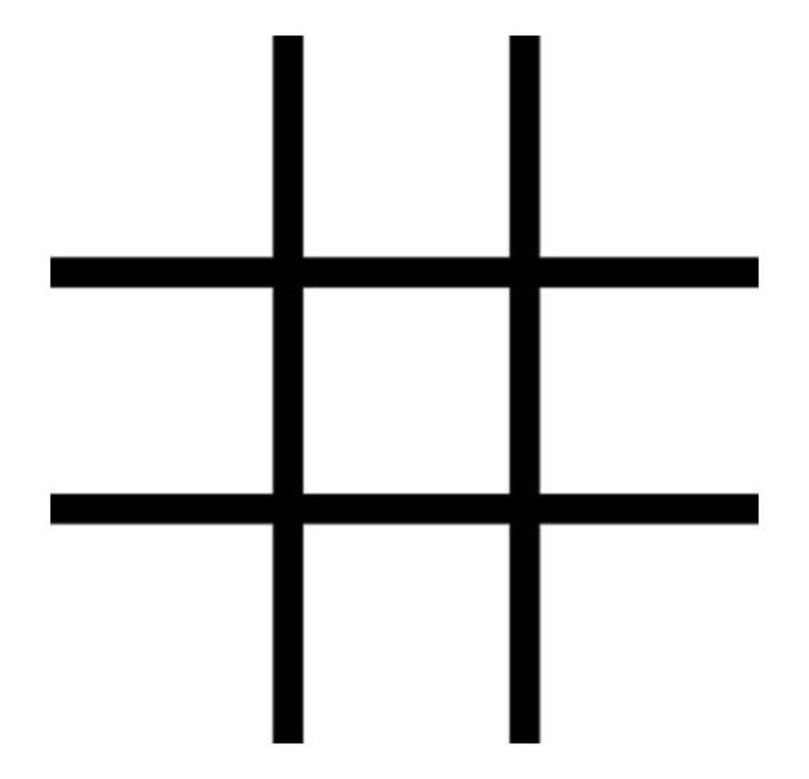
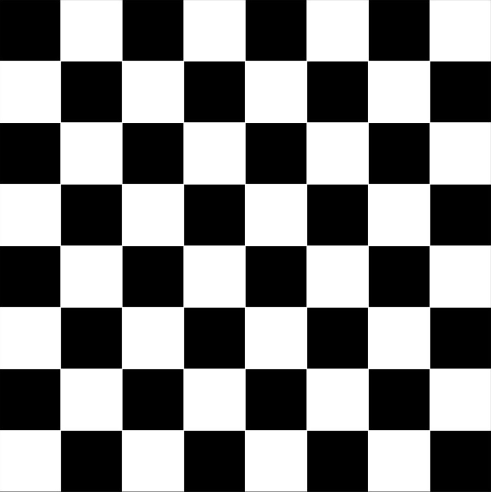
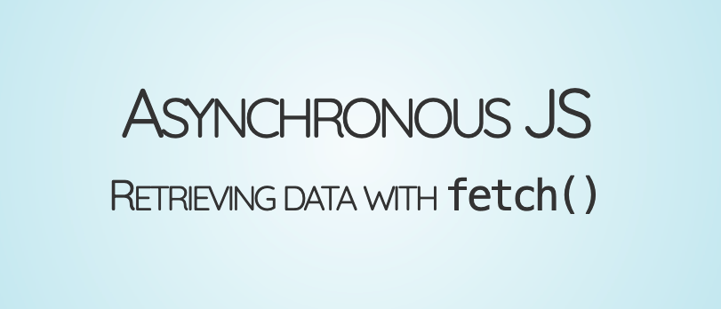
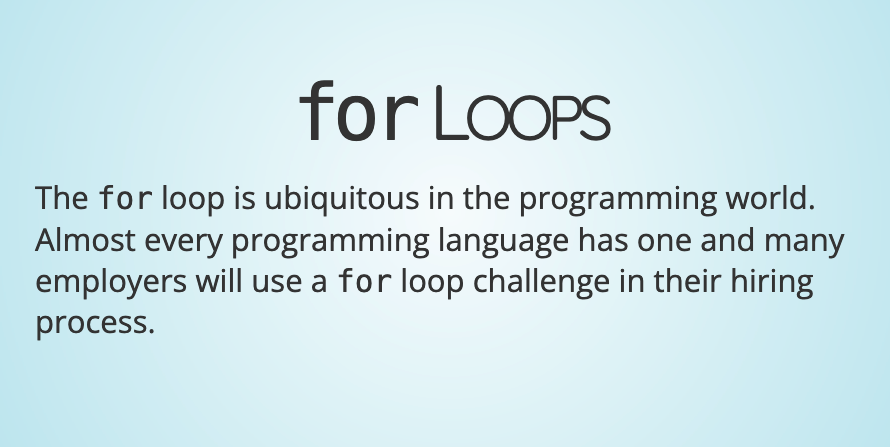
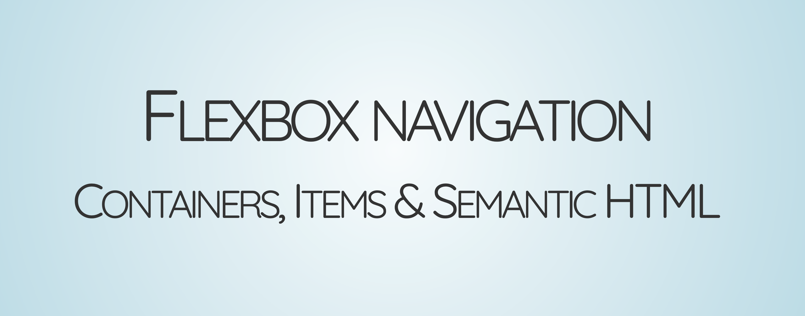
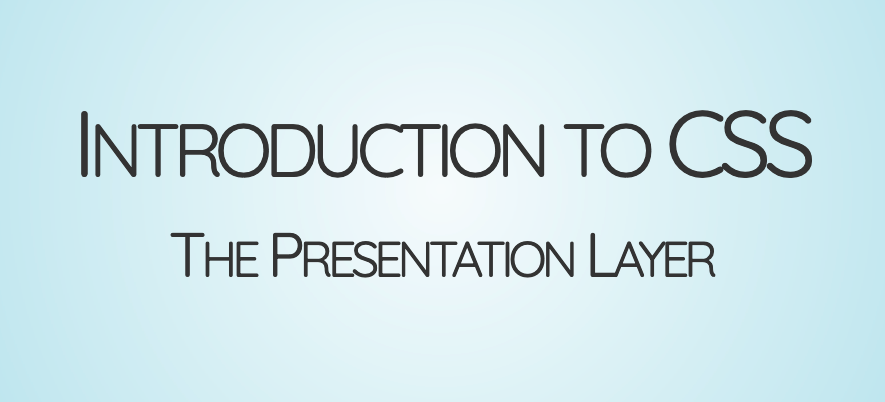
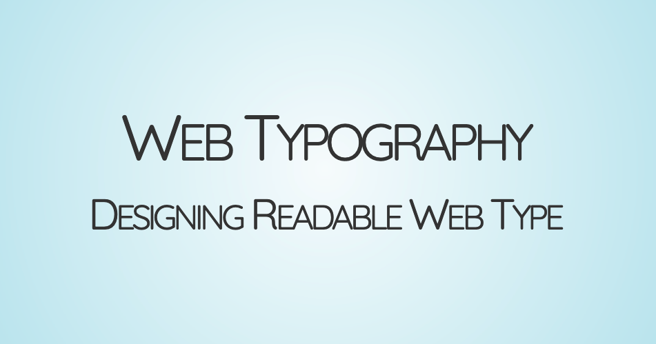

# Sessions - InceptionU Cohort 11
- [Live Site](https://acidtone.github.io/sessions-c11/)
- [Daily sample code](https://github.com/acidtone/daily-code-c11)

---

## Nov 6 - CSS Grid
### Materials
- CSS Tricks: [A Complete Guide to CSS Grid](https://css-tricks.com/snippets/css/complete-guide-grid/)
- MDN: [Learning CSS Grid](https://developer.mozilla.org/en-US/docs/Learn/CSS/CSS_layout/Grids)
- Games: [Grid Garden](https://cssgridgarden.com/)
- Videos
  - Layout Land:
    - [Flexbox vs. CSS Grid — Which is Better?](https://www.youtube.com/watch?v=hs3piaN4b5I)
  - Grid by Example:
    - [Defining a Grid](https://gridbyexample.com/video/series-define-a-grid/)
    - [The fr unit](https://gridbyexample.com/video/series-the-fr-unit/)
    - [Repeat Notation](https://gridbyexample.com/video/series-repeat/)

### Beginner Activities
Using CSS Grid, build one or both of the following:

**An empty Tic-Tac-Toe grid:**

- [Starter Code](https://github.com/acidtone/daily-code-c11/tree/main/2023-11-06-css-grid/00a-tic-tac-toe-starter)
- 3x3 grid of squares
- Borders **between** each square
- Optional: Add static, centred "X" and "O" content in some or all of the squares

**OR**

**Chess board:**

- [Starter Code](https://github.com/acidtone/daily-code-c11/tree/main/2023-11-06-css-grid/00b-chess-board-starter)
- 8x8 grid of squares
- Each square alternates colours like a chess board 

### Galleries
#### Materials
- Layout Land: [Easy Gallery Layout with CSS Grid](https://www.youtube.com/watch?v=tFKrK4eAiUQ)
- Grid by Example:
  - [Introducing minmax()](https://gridbyexample.com/video/series-minmax/)
  - [auto-fit and auto-fill](https://gridbyexample.com/video/series-auto-fill-auto-fit/)

#### Starter Code
- [Gallery Starter Code](https://github.com/acidtone/daily-code-c11/tree/main/2023-11-06-css-grid/00c-gallery-starter)

### Full Page Layout
#### Materials
- MDN: [Document and website structure](https://developer.mozilla.org/en-US/docs/Learn/HTML/Introduction_to_HTML/Document_and_website_structure)
- Layout Land: [Build a Classic Layout FAST in CSS Grid](https://www.youtube.com/watch?v=KOvGeFUHAC0)

#### Starter Code
- [Full Page Starter Code](https://github.com/acidtone/daily-code-c11/tree/main/2023-11-06-css-grid/00d-full-page-starter)

---

## Oct 25 - Asynchronous Fetching
### Materials
- Install: 
  - [Postman](https://www.postman.com/) - A browser for working with APIs
- Reading List:
  - [General asynchronous programming concepts](https://developer.mozilla.org/en-US/docs/Learn/JavaScript/Asynchronous/Concepts)
  - [Introducing asynchronous Javascript](https://developer.mozilla.org/en-US/docs/Learn/JavaScript/Asynchronous/Introducing)
  - [How to Use Fetch with async/await](https://dmitripavlutin.com/javascript-fetch-async-await/)
- Watch list
  - [Async & Await](https://www.youtube.com/watch?v=CWjNefiE47Y) by Programming with Mosh

### Review and Extend: Loops and Arrays of Objects
- Sample Code
  - [Gallery using array of numbers](https://github.com/acidtone/daily-code-c11/tree/main/2023-10-25-async/00a-gallery-ids)
  - [Broken: Gallery using array of objects](https://github.com/acidtone/daily-code-c11/tree/main/2023-10-25-async/00b-broken-gallery-objects)

#### Activity: Fix the Loop
The loop in the above [sample code](https://github.com/acidtone/daily-code-c11/tree/main/2023-10-25-async/00b-broken-gallery-objects) is broken!
1. Refactor the following code so that it works with an array of objects.
2. Add custom `alt` attributes that use the title property.

### HTTP Basics

### The Event Loop
- [Javascript the Weird Parts](https://www.youtube.com/watch?v=Bv_5Zv5c-Ts)
  - @[1:37:35](https://www.youtube.com/watch?v=Bv_5Zv5c-Ts&t=5855s) - The Event Loop and Asynchronous Callbacks

### Fetching Data with `async`/`await`

#### Materials
- Gists: 
  - [Asynchronous data with async/await](https://gist.github.com/acidtone/82944dbaa59aef9247833fe79eae3fb2)
  - [Practice REST API Endpoints](https://gist.github.com/acidtone/673dfc5c11ce06e9e8cd6ce33609eb3c)

---

## Oct 23 - Javascript Loops
### Materials
- MDN: [`for` statement](https://developer.mozilla.org/en-US/docs/Web/JavaScript/Guide/Loops_and_iteration#for_statement)

### Slides

### Activity: FizzBuzz
**FizzBuzz** is the classic interview question.
#### Starter Code
- [Print 1-to-100 with a `for` Loop](https://gist.github.com/acidtone/e87aa5564ae1b286beca66b07d52550f)

#### Instructions
- Print a list of numbers from 1 to 100 using a loop.
- When a number is divisible by 3, change the output value to "Fizz".
- When a number is divisible by 5, change the value to "Buzz".
- When a number is divisible by **both** 3 _and_ 5, change the value to "FizzBuzz".
- If none of the above apply, we just output the number.

### Activity 2: Image Gallery with `for...of`
#### Starter Code
- [Gallery Starter](https://github.com/acidtone/daily-code-c11/tree/main/2023-10-23-loops/02-gallery-starter)

#### Instructions
1. Copy the starter code into your work space.
2. Using the instructions in the comments of `app.js`, use a `for...of` loop to create a gallery of [Lorem Picsum](https://picsum.photos/) images.

---

## Oct 18 - Horizontal Navigation with Flexbox
### Materials
- MDN: [Styling links as buttons](https://developer.mozilla.org/en-US/docs/Learn/CSS/Styling_text/Styling_links#styling_links_as_buttons)
- CSS Tricks: [Complete Guide to Flexbox](https://css-tricks.com/snippets/css/a-guide-to-flexbox/)
- Video: [Flexbox vs CSS Grid](https://www.youtube.com/watch?v=hs3piaN4b5I)

#### Learning Games
- [Flexbox Froggy](https://flexboxfroggy.com/)
- [Flexbox Zombies](https://mastery.games/flexboxzombies/)

#### Sample Code
- [Vertical Nav Menu](https://codepen.io/browsertherapy/pen/XWjwJGL)
- [Flexbox Navigation Examples](https://codepen.io/acidtone/pen/bGMaLNo)
- [Common Flexbox Layout Patterns](https://codepen.io/acidtone/pen/JjvpOKR)

#### Misc Articles
- [Create a navbar with CSS flexbox ](https://dev.to/jungjungie/create-a-navbar-with-css-flexbox-2leh)
- [Creating a Menu with Flexbox](https://www.youtube.com/watch?v=2plKBskaKfY)

#### Courses
- [What the Flexbox!?!](https://flexbox.io/)
    - A 20-video course on Flexbox by Web Bos;
    - Watch these videos if you want to learn more about Flexbox than what we cover in class.

### Slides

#### Activities
Follow the steps and sample code provided in today's slides:
1. [Make a vertical nav menu](html-css/flexbox-nav.html#/2)
2. [Horizontal navigation with Flexbox](html-css/flexbox-nav.html#/11)

---

## Oct 10 - Introduction to HTML and CSS

### 1. Visual hierarchy
- [Design principles: Visual hierarchy](https://www.youtube.com/watch?v=qZWDJqY27bw)

### 2. Introduction to HTML
- [Getting Started with HTML](https://developer.mozilla.org/en-US/docs/Learn/HTML/Introduction_to_HTML/Getting_started)

#### Materials
- Video: [Pair Programming](https://www.youtube.com/watch?v=vgkahOzFH2Q)
  - [Dos and Donts](https://gist.github.com/acidtone/caa20b2520814a94240043c40301024a)

#### Activity: Wikipedia Markup**
1. Pick a hobby or interest that you could build a webpage around;
2. Find open source content on Wikipedia that contains examples of:
	- Headings (`<h1>`-`<h6>`)
	- Paragraphs (`
`)
	- Links (`<a>`)
	- Bold (`<strong>`) and italicized (`<em>`) text
	- Bullet (`<ul>` and `<li>`) and/or numbered (`<ol>` and `<li>`)lists
3. Create an `index.html` file in your workspace
	- Pro-tip: type `!` and then the `Tab` key inside an empty `.html` file to create an empty page!
4. Copy and paste the Wikipedia content inside a `<main>` container inside the `<body>` element of your `.html` page;
5. Wrap the text in the appropriate html element (see above).

### 3. Introduction to CSS

#### Materials
- [Getting Started with CSS](https://developer.mozilla.org/en-US/docs/Learn/CSS/First_steps/Getting_started)
- [CSS values and units](https://developer.mozilla.org/en-US/docs/Learn/CSS/Building_blocks/Values_and_units)

#### Activity: Box Model Styles
Play around and experiment with different box model properties and HTML elements.
- Add a background color to the `<body>` or `<main>` with [`background-color`](https://css-tricks.com/almanac/properties/b/background-color/).
- Add [`padding`](https://developer.mozilla.org/en-US/docs/Web/CSS/padding) on a container so the text doesn't touch the edge of the container.
- Add an accent line using [`border-left`](https://developer.mozilla.org/en-US/docs/Web/CSS/border-left) or [`border-bottom`](https://developer.mozilla.org/en-US/docs/Web/CSS/border-bottom).
- Centre the text _within_ a heading using [`text-align`](https://developer.mozilla.org/en-US/docs/Web/CSS/text-align).
- Use the [`max-width`](https://developer.mozilla.org/en-US/docs/Web/CSS/max-width) property to limit the line length of your text to `650px` (or similar);
    - Hint: you can apply this to a container (i.e. `<main>`) to affect all text inside the container.
- Italicize the first paragraph using [`font-style`](https://developer.mozilla.org/en-US/docs/Web/CSS/font-style) and a [class selector](https://developer.mozilla.org/en-US/docs/Web/CSS/Class_selectors).
- Use [`margin: auto`](https://www.hongkiat.com/blog/css-margin-auto/) to add equal spacing to the sides of a container of body text.
  - Note: this will only work if the container width is less than 100% of its parent.

### 4. Web Typography

#### Materials
- Video: [Design principles: Typography](https://www.youtube.com/watch?v=yom0nogFN3k)
- [Fundamental text and font styling](https://developer.mozilla.org/en-US/docs/Learn/CSS/Styling_text/Fundamentals)

#### Activity: Styling Text
Continue with the wikipedia text and customize your text and font styles:
- Increase the font size from its `16px` default using [`font-size`](https://developer.mozilla.org/en-US/docs/Web/CSS/font-size) on the `<body>` element.
- Increase the leading of your text from the page's `1.2` default by setting `line-height` on the `<body>`.
- Refactor your `max-width` declaration from the previous activity so that it uses the `ch` unit. Change your max line length to `85ch`.
- User [Google Fonts](https://fonts.google.com/) to set a custom Display font on your headings and a Text font for the rest of your text.

**Don't forget to push your code to a public GitHub repo to keep up your green!**

---

## Oct 5 - Git, GitHub and the Command Line

**Important**: Create a GitHub account (professional username, plz) and Ping your username to Grimes in Basecamp.

### 1. Files, Directories and the command line
- Slides: [URLs and File Paths](https://acidtone.github.io/sessions-c11/misc/urls-file-paths.html)
- [Files, directories and naming conventions](https://gist.github.com/acidtone/d77059ec1851eff266339a3df70f6984)
- [Command Line Basics](https://gist.github.com/acidtone/316d2bd9cf59f841684dbd68ffc3ee95)
- Activity: [Follow the White Rabbit](https://gist.github.com/acidtone/6e3b69b7f2a81573d683b716fb069296)

### 2. Git and Github
- Slides: [Git and GitHub Basics](assets/files/Tech%20Appendix%20-%20Git%20and%20GitHub%20Basics.pdf)
- Activities:
  - [Git: First-time setup](https://gist.github.com/acidtone/6ca4c62d88570732d3760904ef965e4d)
  - [Clone Happy](https://gist.github.com/acidtone/1a6e3324d97e61fa0ee59bc4cba3ef33)
  - [Project: Publish a webpage with Git and GitHub Pages](https://gist.github.com/acidtone/5d45f96bc11fada75038e552f9ba1a5c)
- Don't like the command line? Try [using Git source control in VS Code](https://code.visualstudio.com/docs/sourcecontrol/overview)

---

## Oct 3 - Dev Life and Searching like a nerd

- Slides:
  - [Better Search Phrases](https://acidtone.github.io/sessions-c11/misc/better-search-phrases.html)
  - [Browser Triad](https://acidtone.github.io/sessions-c11/html-css/browser-triad.html)
  - [UI Triad Quiz](https://acidtone.github.io/sessions-c11/html-css/ui-triad-quiz.html)
- Resources
  - Video: [HTML Tutorial for Beginners: HTML Crash Course](https://www.youtube.com/watch?v=qz0aGYrrlhU) by Mosh Hamedani
  - [Getting started with HTML](https://developer.mozilla.org/en-US/docs/Learn/HTML/Introduction_to_HTML/Getting_started)
  - [CSS Basics](https://developer.mozilla.org/en-US/docs/Learn/Getting_started_with_the_web/CSS_basics)
- HTML/CSS/JS Course: [Mimo.org](https://mimo.org)
  - Recommended by many past learners.

---

